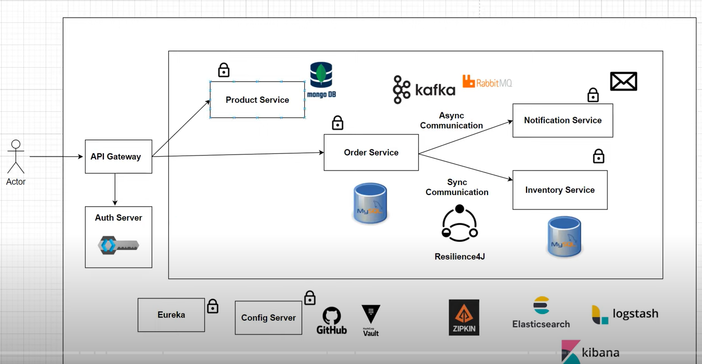

# Spring Boot Microservice project 

This example code is used for running a Java 17 spring microservice application. 

It uses below tools and technologies mentioned in the picture.

## Architecture Used

